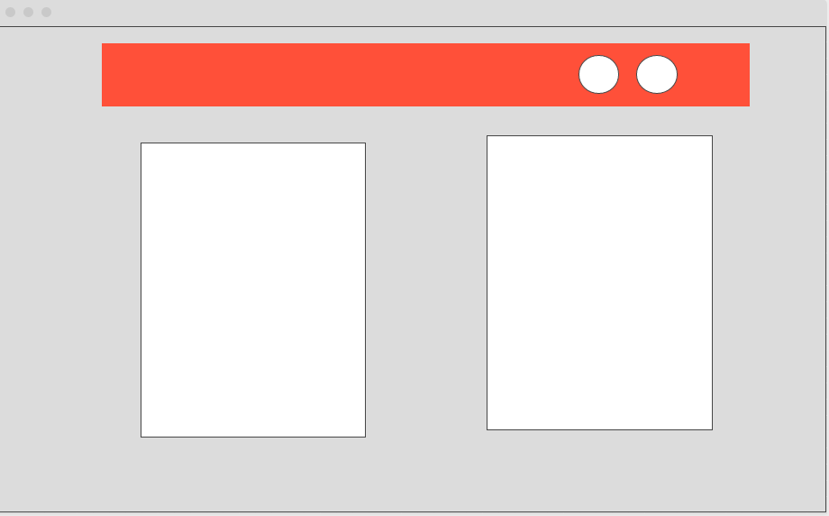
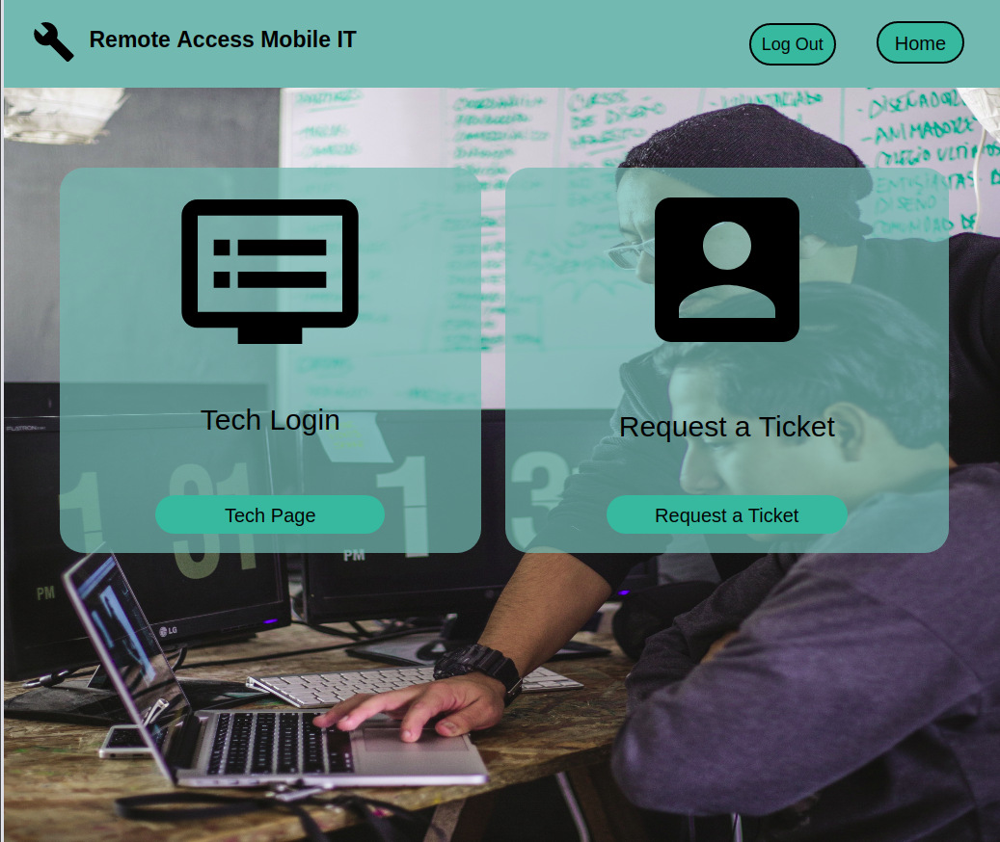

## Remote Access Mobile IT

---
### Pseudo code
---
* Create a landing page with two sides, one that redirects after login to the tech side and another to request a ticket

* Allow only techs to view pending tickets from customers

* Can't access other tickets
 if you're not logged in as a tech.

* Allow techs to "resolve" (delete) a ticket.
---
### Stretch Goals
---
* Allow Techs to have a clock in page to keep track of how many hours they've worked in that day
* Allow customers to see their submitted ticket for confirmation
* Allow Customers to edit their information while viewing their ticket
* 
---
### User Stories
---
* AAU I would like to login and be able to see all incoming customer tickets

* AAU I would like to be able to input all my information and have a ticket submited instantly

* AAU I would like to be able to edit my information after submitting a tickets
---
### Technologies Used
---
* HTML
* CSS 
* javaScript
* Node.js
* Express Genorator
* MongoDB
---
### Deployed Link
---
https://ram-it.herokuapp.com/

